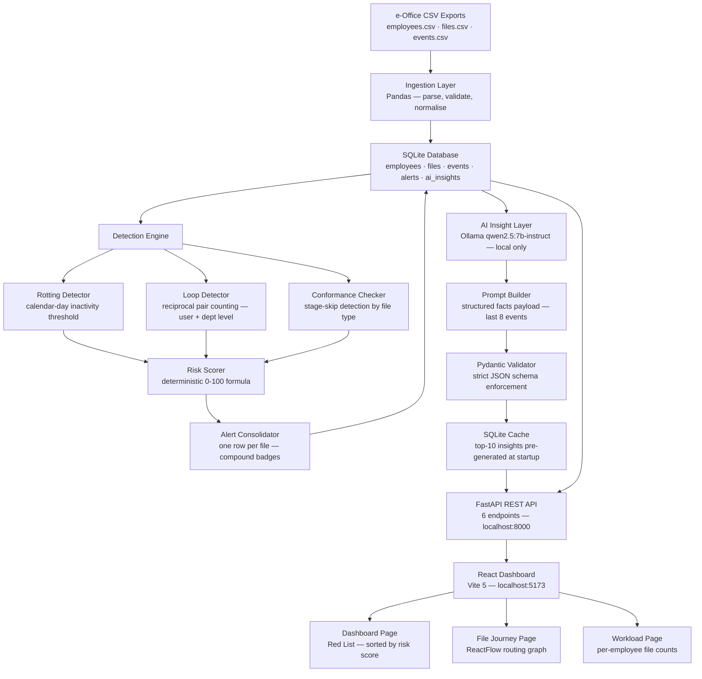

# Architecture Proposal

- **Team name:** Future PMs
- **Team code:** TEAM-067
- **Track:** Strong Institutions

---

## 1. Problem

Government offices in India process thousands of files every day through the e-Office platform — a digital system that has replaced physical file movement with electronic forwarding, noting, and approval. The platform does its job well as a record-keeping system: it tells you where a file is, who holds it, and when it was last touched. What it cannot tell you is whether anything meaningful is actually happening.

This creates a specific and well-documented blind spot. A file assigned to a junior assistant in February can sit completely untouched until May, and e-Office will faithfully report it as "Active — With Amit Kumar." No alarm fires. No supervisor is notified. The system sees no problem because it was never designed to look for one.

The second pathology is subtler. A file can bounce back and forth between two departments six, eight, ten times — generating a long trail of timestamps and activity notes — while making zero forward progress. One officer requests a clarification. The other provides it. The first officer requests a different clarification. The pattern repeats. e-Office interprets this as active processing. An external observer would recognise it as bureaucratic deadlock.

Both of these patterns have real consequences. DARPG's Special Campaign 4.0, conducted in October 2024, manually cleared over 25 lakh files from across the country — proof that the problem is not isolated. DoPT reviewed more than 5,000 e-Office files during the same campaign and force-closed nearly 1,800 of them. CAG audits cite administrative delays as a direct contributor to cost overruns in infrastructure projects. RTI disclosures have documented files sitting on a single desk for eight months. The official government guideline already mandates review of files inactive for more than 90 days — but there is no automated mechanism to flag them.

The Section Officer who manages a section of 150 files has no tool to generate this list on Monday morning. He has to remember, ask, or manually hunt through the system. Most of the time, the stuck file surfaces only when an external deadline is missed or a senior officer calls to ask why nothing has happened.

FilePulse is built to solve this specific problem.

---

## 2. Who It Helps

The primary user is the Section Officer — a mid-level government official who supervises a team of two to four junior assistants and is responsible for the forward movement of 120 to 150 active files at any given time. In our design, this person is Mr. Iyer: a moderately tech-comfortable officer who knows the context of every file in his section but has no reliable way to identify which ones are silently stalling.

Mr. Iyer has the authority to intervene. He can walk to a junior's desk and ask for an update by end of day. He can schedule a cross-department meeting to unblock a file that has been bouncing between sections. He cannot, however, monitor 150 files manually with any consistency. What he needs is an exception-based view — a short list, presented clearly, of only the files that require his attention today.

Secondary beneficiaries include the officers above Mr. Iyer in the hierarchy, who currently have no visibility into section-level pendency without asking for it manually. As FilePulse generates structured alert data, that data becomes auditable: it can show, over time, which files consistently stall at which stage and with which officer.

The citizen ultimately benefits indirectly. A school roof repair grant that stalls for 45 days while the monsoon season approaches is not an abstract bureaucratic failure — it is a roof that does not get fixed in time.

---

## 3. Proposed Solution

FilePulse is a local, offline-capable diagnostic dashboard that reads e-Office activity logs and surfaces only the files that need a supervisor's attention. It does not replace e-Office and does not require any changes to the existing platform. It sits alongside it as an analytics layer.

The system ingests structured CSV exports of e-Office logs — the kind of data any office already has or can generate — and runs two deterministic detection algorithms against them. The first identifies files that have had no meaningful activity beyond a configurable threshold, ranking them by severity. The second identifies files that are bouncing repeatedly between the same two parties without progressing, which is the computational signature of accountability-avoidance through clarification loops.

Both algorithms are rule-based. There is no machine learning involved in detection. The thresholds mirror official government guidelines: 90 days of inactivity is already a mandatory review trigger, so the system flags it; 45 days is flagged as critical; 30 days as high priority. For loops, a file must have bounced at least three times in each direction within a 30-day window before it is flagged — this threshold is deliberately conservative, designed to avoid false positives on legitimate clarification exchanges.

Once an anomaly is detected, a locally-running language model — Ollama with the Qwen 2.5 7B model — is given a structured summary of the facts: the file's metadata, alert type, days inactive, deadline status, and the last eight events as readable strings. The model is asked to translate this into plain administrative language: what appears to be happening, what the likely blocker is, and what action is recommended. The model runs at temperature zero and is constrained to output valid JSON. It never decides whether a file is stuck — that decision has already been made deterministically. It only explains it in terms a Section Officer can act on.

All AI insights are pre-generated at startup and cached in a local SQLite database. The dashboard never calls the AI model during a user interaction. If the model fails or is unavailable, a rule-based fallback template is shown instead. The dashboard never breaks.

The front-end presents three views. The main dashboard is the Red List: a sorted, filterable table of anomalous files, each with a compound badge showing which alert types fired, a risk score, the current holder's name, days inactive, and the AI-generated plain-language summary. The second view is the File Journey: a flow graph showing the complete routing history of a file, built using ReactFlow, with edges coloured to highlight loops. The third view is the Workload page, which shows per-employee file counts and helps identify whether a stall is caused by a single overloaded officer.

---

## 4. High-Level Architecture

Data flows in one direction at startup: CSVs are ingested into SQLite, detectors run over the event data, alerts are scored and stored, and the top ten risk-scored alerts have their AI insights pre-generated and cached. The FastAPI server then serves read-only queries from the cached database. The React frontend makes no direct database calls and holds no application state between sessions. Every number on the dashboard traces back to a deterministic rule that can be explained and audited.

---

## 5. Tech Stack

**Backend**

The backend is written in Python 3.11 and served by FastAPI with Uvicorn. Pandas handles CSV ingestion and the detection algorithms, which are implemented as straightforward dataframe operations. The database is SQLite, accessed through Python's standard library sqlite3 module — no ORM, no migration framework. Pydantic v2 is used for request and response validation throughout the API layer, and for enforcing the schema on Ollama's JSON output. HTTP communication with the local Ollama server uses httpx.

**AI**

The AI component uses Ollama running locally on the same machine. The model is Qwen 2.5 7B Instruct, called with temperature set to zero to ensure deterministic, conservative output. The model is called in JSON format mode, which constrains its output to a parseable structure. No cloud AI services, no API keys, no internet dependency. The system is designed to work in an air-gapped government office environment.

**Frontend**

The frontend is React 18, bundled with Vite 5 and written in plain JavaScript. Tailwind CSS 3.4 handles styling. ReactFlow 11 renders the file journey graph. React Router 6 manages the three-page application. No state management library beyond React's built-in hooks.

**What we are not using**

We are explicitly not using SQLAlchemy, LangChain, Redux, Zustand, Axios, TypeScript, Docker, or any cloud platform service. Each of these would add complexity without adding capability for this specific problem scope.

---

## 6. Milestones to Hackathon Day

- [x] Problem defined and SPECS.md locked with detection algorithm specification
- [x] Mock dataset designed: 12 files, 9 employees, 60 events — covering all alert scenarios
- [x] Backend scaffolding: FastAPI, config.py, directory structure
- [x] Frontend scaffolding: Vite + React + Tailwind installed
- [ ] app/db.py — SQLite schema creation and CSV ingestion
- [ ] app/core/stuck_detector.py — rotting detection with severity ladder
- [ ] app/core/loop_detector.py — user-level and department-level loop detection
- [ ] app/core/risk_scorer.py — deterministic 0-100 risk formula
- [ ] app/ai/ollama_service.py + prompts.py — Ollama call with fallback
- [ ] app/api/routes.py — all six API endpoints
- [ ] main.py — startup ingestion, detection, AI pre-generation, routes mounted
- [ ] Frontend: api/client.js, DashboardPage (Red List), FileDetailPage (Journey Graph), WorkloadPage
- [ ] tests/test_validation.py — detection output validated against known dataset
- [ ] End-to-end demo run: CSV in, Red List rendered, File Journey shown, AI insight displayed

---

## 7. Open Questions / Help Needed
